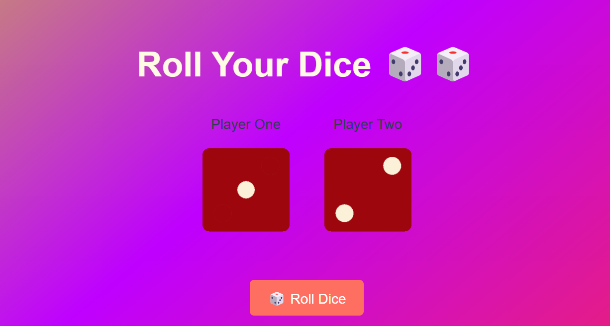

# 🎲 Dice Game

Dice Game is a simple, fun, and interactive web app where players roll dice and compete to see who gets the highest score! Built with vanilla HTML, CSS, and JavaScript, it features a sleek design and a beautiful animated gradient background that enhances the gaming experience.

---



---

## 🔗 Live Demo

Check out the live website here: [Dice Game Live Demo](https://kaweeshwara.github.io/Dice-Roll/)

---

## 📂 Features

- 🎲 Turn-based dice rolling system (Player 1 rolls first, then Player 2)
- 🎯 Player highlighting to show whose turn it is
- 🏆 Automatic winner declaration after both players roll
- ✨ Sleek and minimalist design for an enjoyable user experience
- 🎨 Animated gradient background for an eye-catching aesthetic
- 📱 Fully responsive and works smoothly on all devices
- ⏱️ Automatic game reset after each round

### How to Play

1. Game starts with Player 1's turn
2. Player 1 clicks the "Roll Dice" button
3. After Player 1 rolls, turn switches to Player 2
4. Player 2 rolls to complete the round
5. Winner is displayed with a trophy 🏆
6. Game automatically resets after 2 seconds

---

## 🛠️ Tech Stack

- **Languages**: HTML, CSS, JavaScript
- **Hosting**: GitHub Pages

---

## 🚀 Getting Started

1. Clone the repository:

   ```bash
   git clone https://github.com/kaweeshwara/Dice-Roll.git
   ```

2. Open `index.html` in your browser to play the game!

---

Enjoy rolling the dice! 🎲✨
